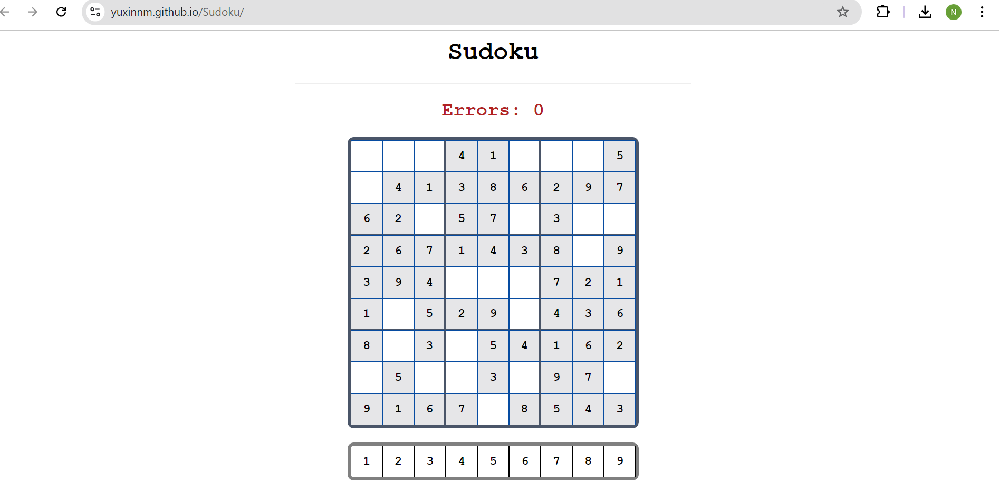
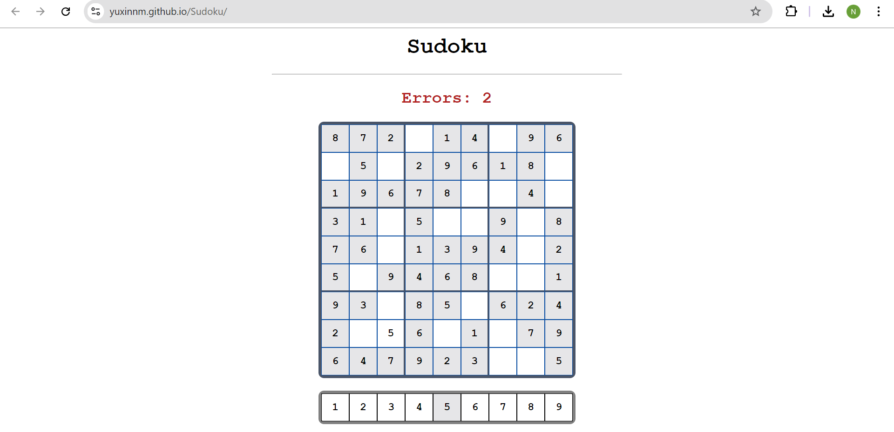

# 🧩 Sudoku Game

An interactive and visually appealing **Sudoku game** built with **JavaScript**, **HTML**, and **CSS**. The app features a responsive UI, dynamic puzzle generation, intuitive input handling, and real-time visual feedback to enhance the user experience.

---

## 🎮 Features

- 🎨 **Aesthetic Interface** – Clean and aesthetic design for easy readability and smooth interaction.
- 🔄 **Dynamic Board Generation** – A fresh Sudoku puzzle is generated every time you refresh.
- ⌨️ **Effective Input Handling** – Update error at the top of the screen when there are mistakes.
- 🖱️ **Interactive Cells** – Click any cell to select it and start playing.
- 🧠 **Optional Solver (Coming Soon)** – Planned feature to solve any valid Sudoku board.

---

## 📸 Screenshots

> **
> **

---

## 🛠️ Tech Stack

- **HTML5** – Page structure and layout
- **CSS3** – Styling and responsive visuals
- **JavaScript (ES6+)** – Game logic and user interaction
- **Git & GitHub** – Version control and hosting
- **GitHub Pages** – Deployment and live preview
---

## 🚀 Getting Started

[▶️ Click here to play the game live](https://yuxinnm.github.io/Sudoku/)

## Or

### 1. Clone the repository

```bash
git clone https://github.com/YuxinNM/Sudoku.git
cd Sudoku
```

### 2. Open the game

Just open `index.html` in your browser:

```bash
# On macOS/Linux:
open index.html

# On Windows (PowerShell):
start index.html
```

> Alternatively, drag `index.html` into your browser.

---


## 📂 Project Structure

```
Sudoku/
├── css/
│   └── style.css                  # Styles for the board and UI
├── js/
│   ├── boardGenerator.js          # Puzzle generation logic
│   └── sudoku.js                  # Keyboard and mouse input logic
├── index.html                     # Main HTML file
└── README.md
```

---

## 🎯 How to Play

- Click a tile (1-9) at the bottom of the screen to select it.
- Click an empty cell on the board to enter the value selected.
- The error message at the top of the screen will update accordingly.
- Refresh the page to generate a new puzzle.

---

## 💡 Planned Features

- Difficulty selector (Easy, Medium, Hard)
- Puzzle solver and hint system
- Timer and high score tracking

---

## 🙋‍♀️ Author

**Nancy Ma**  
GitHub: [@YuxinNM](https://github.com/YuxinNM)

---

## 📜 License

This project is licensed under the [MIT License](LICENSE).
